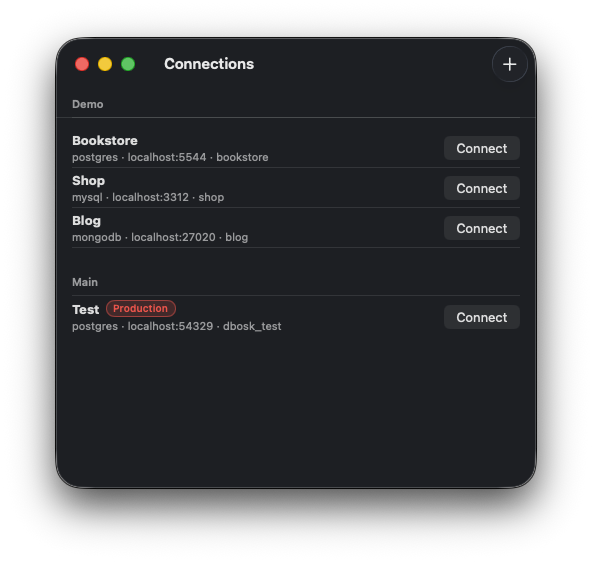
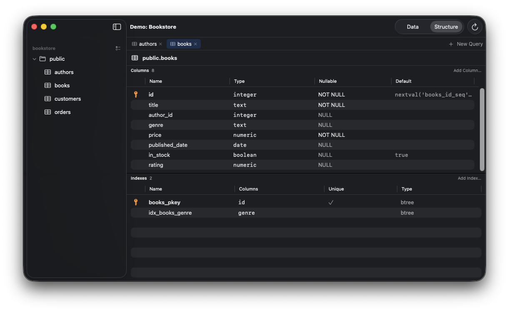
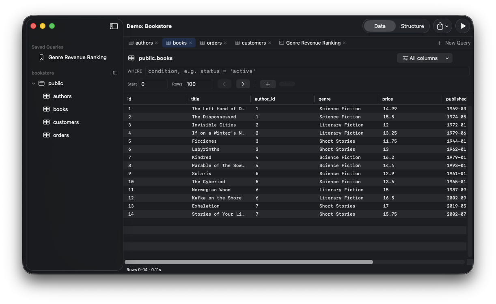
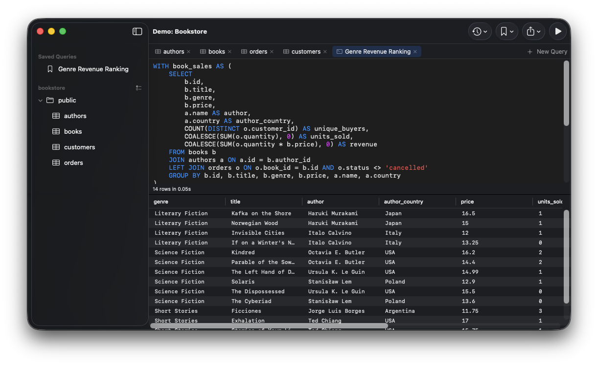
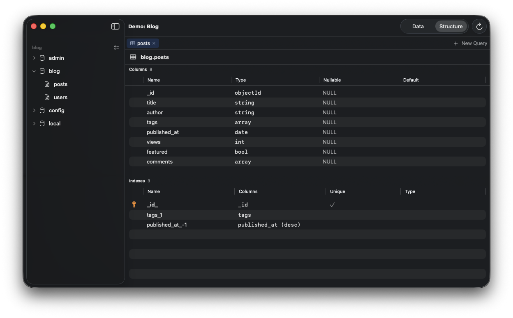
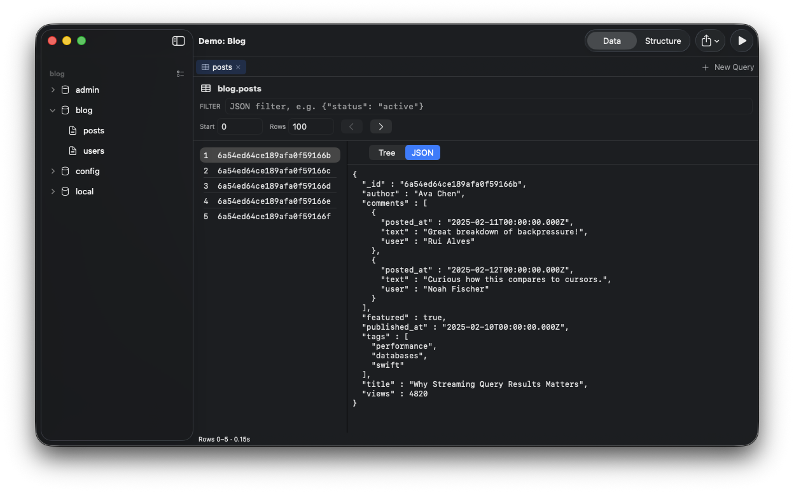

<p align="center"></p>

# dbosk

A native macOS database client (SwiftUI + AppKit) for PostgreSQL, MySQL/MariaDB,
MongoDB, and SQLite. Streaming results, cancellable queries, CSV/JSON export,
saved queries, table notes/groups/visibility, and shell-script credential
loading (1Password CLI, AWS, …).

## Screenshots

| | |
|---|---|
|  Manage multiple connections, grouped and labeled |  Inspect columns, types, and indexes |
|  Browse table data with filters and paging |  Write and save complex SQL, browse results inline |
|  Same structure view for MongoDB collections |  Browse documents as JSON or tree |

## Install with Homebrew

This repository is its own Homebrew tap. There is no prebuilt download or
GitHub Release: `brew install` compiles the app from the `main` branch on
your machine, so you need Xcode 16+ and macOS 14 (Sonoma) or newer. A
formula is used rather than a cask because casks only install prebuilt
artifacts, which this project does not publish.

```sh
# 1. Tap this repository (registers it as a third-party tap):
brew tap kellertobias/dbosk https://github.com/kellertobias/dbosk

# 2. Install from source. The fully-qualified name scopes trust to exactly
#    this tap — it can never resolve to a same-named package from
#    homebrew/core or another tap:
brew install --HEAD kellertobias/dbosk/dbosk

# 3. Optional: make the app visible in Launchpad and Spotlight:
ln -sf "$(brew --prefix)/opt/dbosk/Dbosk.app" /Applications/Dbosk.app
```

Update to the latest `main` (rebuilds only when new commits exist):

```sh
brew update
brew upgrade --fetch-HEAD kellertobias/dbosk/dbosk
```

Force a clean rebuild at the current commit:

```sh
brew reinstall kellertobias/dbosk/dbosk
```

Uninstall and remove the tap:

```sh
brew uninstall kellertobias/dbosk/dbosk
brew untap kellertobias/dbosk
```

### Signing and Gatekeeper

The Homebrew build is compiled locally and ad-hoc signed (`codesign --sign -`).
Gatekeeper only assesses apps that carry the quarantine attribute, which macOS
attaches to files downloaded by browsers and other quarantine-aware apps. An
app compiled on your own machine is never quarantined, so it launches without
any Gatekeeper prompt and no workarounds are needed. Distributing prebuilt
binaries to other machines is different: those downloads *are* quarantined,
and passing Gatekeeper then requires signing with a paid Apple Developer ID
certificate plus notarization by Apple — `Scripts/make-app.sh` supports that
via `DBOSK_SIGN_IDENTITY` (see below).

## Build & run (development)

```sh
swift build
swift run Dbosk        # or .build/debug/Dbosk
```

## Tests

Unit tests run standalone; driver integration tests need the docker databases:

```sh
swift test                                   # unit + SQLite (no server needed)
docker compose up -d postgres                # port 54329
docker compose --profile phase4 up -d        # + mysql (33069), mongo (27019)
DBOSK_PG_TESTS=1 DBOSK_MYSQL_TESTS=1 DBOSK_MONGO_TESTS=1 swift test
```

## App bundle & distribution

```sh
Scripts/make-app.sh            # dist/Dbosk.app (ad-hoc signed, local use)
Scripts/make-app.sh --dmg      # + dist/Dbosk.dmg
```

For notarized distribution, sign with a Developer ID and submit the DMG:

```sh
export DBOSK_SIGN_IDENTITY="Developer ID Application: Your Name (TEAMID)"
Scripts/make-app.sh --dmg
xcrun notarytool submit dist/Dbosk.dmg --keychain-profile <profile> --wait
xcrun stapler staple dist/Dbosk.dmg
```

The app is intentionally **not sandboxed**: the script-based credential loader
runs arbitrary user executables (e.g. `op`, `aws`) and reads their stdout.

## SSH tunnels

A connection can be routed through an SSH bastion (toggle in the connection
editor). The tunnel uses the system `ssh` binary with local port forwarding,
so your `~/.ssh/config`, agent, and known_hosts apply. Auth is key-based only
(agent or an explicit identity file); the database host/port configured on
the profile are resolved *from the SSH host*. Tunnel tests:

```sh
docker compose --profile ssh up -d ssh postgres
DBOSK_SSH_TESTS=1 swift test
```

## Credential scripts

A connection can load its credentials at connect time from an executable that
prints JSON to stdout:

```json
{ "host": "…", "port": 5432, "user": "…", "password": "…", "database": "…", "uri": "postgres://…" }
```

All keys are optional and merged over the profile's fields; `uri` wins when
present. stderr is shown on failure; stdout is never logged or persisted.

## AWS Secrets Manager

A connection can instead reference an AWS Secrets Manager secret ("AWS Secret"
credential mode in the editor). Authentication uses your existing `~/.aws`
setup — pick a named profile (SSO profiles work; run `aws sso login --profile
<name>` first) or leave it empty for the default credential chain. The region
comes from the connection, the secret's ARN, the profile's config, or
`AWS_REGION`, in that order.

The secret's JSON follows the RDS-managed shape. At connect time the secret
supplies the password and fills in any fields the profile leaves empty —
host, port, user, and database set on the connection win over the secret's
values (useful when the secret's endpoint is only resolvable inside the VPC).
Nothing from the secret is persisted locally:

```json
{ "username": "…", "password": "…", "host": "…", "port": 5432, "dbname": "…" }
```

`user`/`database`/`hostname`/`uri` aliases are accepted; a plain-string secret
is treated as just the password. Secrets with non-standard key names can be
mapped in the editor: "Fetch Keys" lists the secret's key names (values are
never shown) and each field gets a dropdown to pick its key, with "Auto"
falling back to the aliases above. Opt-in integration test:

```sh
DBOSK_AWS_TESTS=1 DBOSK_AWS_SECRET_ID=prod/db [DBOSK_AWS_PROFILE=…] swift test
```

## Layout

- `Sources/DBCore` — value model (`DBValue`), `DatabaseDriver` protocol, streaming `QueryExecution`
- `Sources/DBDriver{Postgres,MySQL,Mongo,SQLite}` — driver adapters
- `Sources/Connections` — profiles, Keychain, credential scripts, per-connection metadata
- `Sources/Export` — streaming CSV/JSON exporters
- `Sources/Dbosk` — the app (SwiftUI shell, AppKit results grid + editor)
